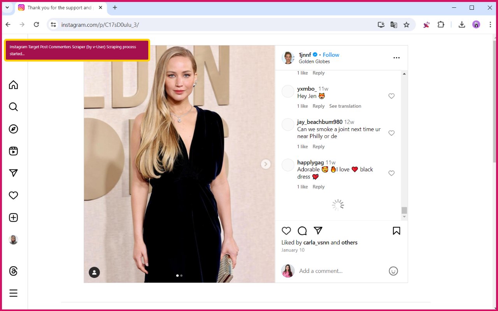
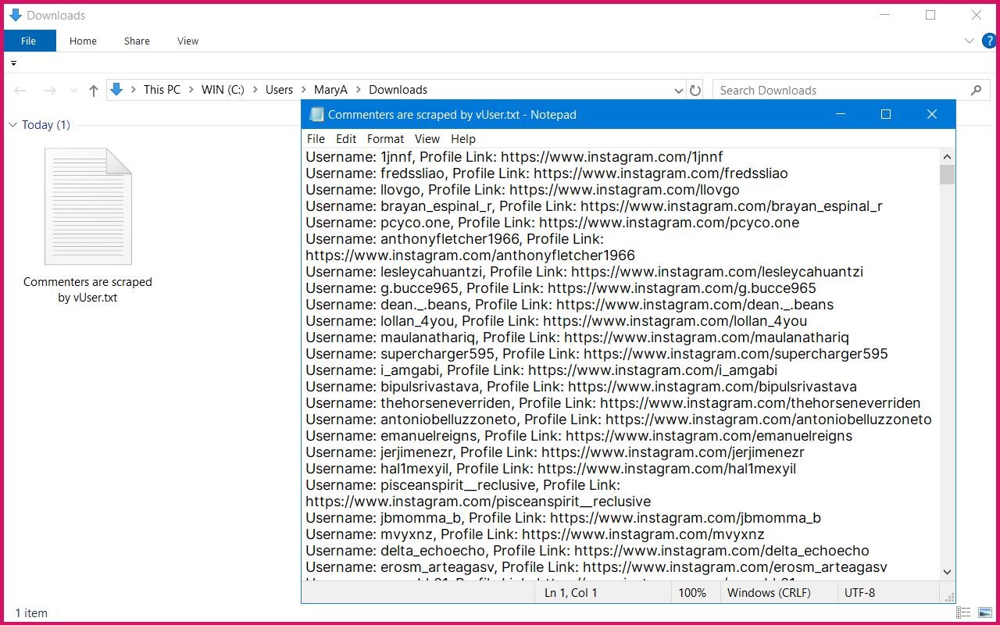

# Instagram Commenter Scraper Chrome Extension

## Overview

This Chrome extension scrapes commenters from a target Instagram post. Simply open the post, click the scrape button, and the extension will gather usernames and profile links of the commenters, saving them in a .txt file in your download folder.

### Features
*   **Scrapes Instagram commenter usernames and profile links**
*   **Saves data in a `.txt` file**
*   **Easy one-click scraping process**
*   **Provides progress notifications**

### How to Use
1. Install the extension in Chrome.
2. Go to the Instagram post you want to scrape.
3. Open the list of commenters.
4. Click the scrape button in the extension.
5. Wait for the process to finish.
6. Find the data in your download folder.

## Installation
1. Download the extension from [MehDAsaD/instagram-commenter-scraper-chrome-extension](https://github.com/MehDAsaD/instagram-commenter-scraper-chrome-extension/tree/main).
2. Open Chrome and go to "[chrome://extensions/](chrome://extensions/)".
3. Enable "Developer mode".
4. Click "Load unpacked" and select the extension folder.

### Technical Details
- Utilizes JavaScript for web scraping.
- Provides real-time notifications.
- Automatically scrolls to load all comments.
- Saves data as a text file.
  

### Screenshots
1. Click on the Instagram Commenter Extractor extension icon to view the user interface in a pop-up. Click the "Click to Start Scraping" button to begin extraction.

   

2. You will see that the commenters are being extracted.

   

3. The commenters information is automatically saved in the Downloads folder on your system.

   

#InstagramScraper #ChromeExtension #DataExtraction #WebScraping #JavaScript #InstagramCommenterScraperChromeExtension #InstagramCommenterScraperExtension #CommenterScraper
